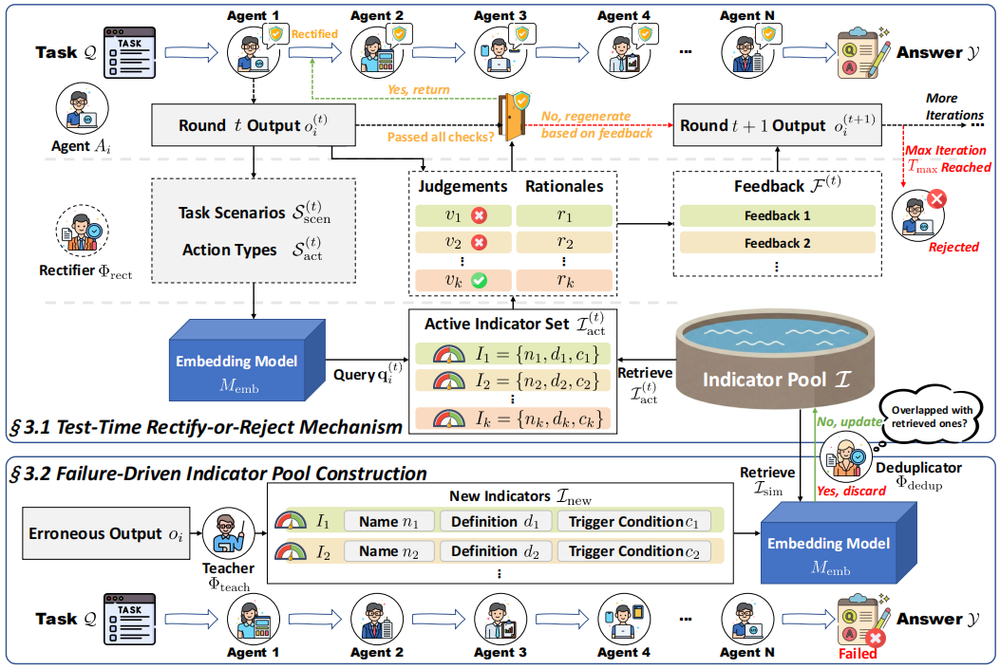

# AgentDropoutV2

This repository anonymously releases the codes and data for the paper:  
**AgentDropoutV2: Optimizing Information Flow in Multi-Agent Systems via Test-Time Rectify-or-Reject Pruning**

## **🔗 Quick Links**

- **[About AgentDropoutV2](#about)**
- **[File Structure](#structure)**
- **[Requirements](#requirements)**
- **[Quick Start](#start)**
- **[Acknowledgments](#Acknowledgments)**

## **🛡️ About AgentDropoutV2**<a name="about"></a>

**AgentDropoutV2** is a test-time framework designed to dynamically optimize information flow in Multi-Agent Systems (MAS) without expensive retraining. 

It acts as an active firewall during MAS execution:
1.  **Intercept**: It intercepts agent outputs before they are broadcast.
2.  **Rectify**: A retrieval-augmented rectifier scrutinizes the output using a **Failure-Driven Indicator Pool** (constructed from historical error patterns). It provides targeted feedback for iterative correction.
3.  **Reject**: If the output remains flawed after maximum retries, it is pruned to prevent error propagation.
4.  **Fallback**: A safeguard mechanism preserves structural integrity if too many agents are pruned.


<p align="center">
  
</p>
<p align="center"><strong>The Framework of AgentDropout</strong></p>

## **📜 File Structure**<a name="structure"></a>

The repository is organized into two main components: `train` (for offline indicator pool construction) and `test` (for online inference).


## **🛠️ Requirements**<a name="requirements"></a>

This project can be reproduced with a single Python environment:

```bash
conda create -n myenv python=3.10.18
conda activate myenv
pip install -r requirements.txt
```


## **🚀 Quick Start**<a name="start"></a>

### **1. Test-Time Inference (Main Workflow)**

> **Before running this part**: many `*.sh` and `*.py` files contain configurable fields such as model name, API URL/base URL, API key, and data/output paths (often marked as `####` / `###`). Please fill them based on your setup first.

1. **Generate trigger embeddings for the indicator pool**
   ```bash
   cd test/metrics_pool/two_pool
   python embed_metrics-trigger.py
   ```
   This step generates the `.jsonl` embedding cache required at test time.

2. **Run evaluation scripts to produce result files**
   ```bash
   cd ../../
   bash run-xxx.sh
   ```
   Replace `run-xxx.sh` with your target benchmark script (for example: `run-math500.sh`, `run-aqua.sh`, `run-livecode.sh`).

3. **Compute final accuracy from result file**
   ```bash
   cd test
   python calc_accuracy.py
   ```
   Set `FILE_PATH` in `calc_accuracy.py` to your generated result file path before running.

### **2. Training & Build Your Own Indicator Pool (Optional)**

> **Before running this part**: scripts in `train/` also require you to fill model, URL/base URL, API key, and local path settings according to your environment.

1. **Run training-time scripts to get raw result files**
   ```bash
   cd train
   bash run-xxx.sh
   ```
   Replace `run-xxx.sh` with your selected training script (for example: `run-math-train.sh`, `run-aqua-train.sh`).

2. **Extract, deduplicate, and build trigger embeddings**
   ```bash
   python Extraction-deduplication-embedding.py
   ```
   This script completes:
   - extraction of raw indicators from training outputs,
   - deduplication into a cleaner metric pool,
   - embedding generation for `trigger_condition` (used by test-time retrieval).

3. **Use your custom pool in test scripts**
   Update `METRIC_POOL_FILE` and `EMBEDDING_CACHE_FILE` in `test/run-*.sh` to point to your newly generated files.

## **Acknowledgments**

This code framework is based on AutoGen and AgentDropout.
