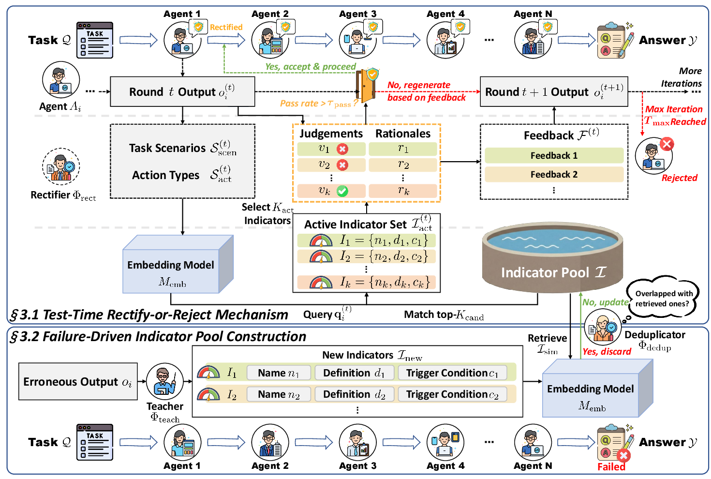

# AgentDropoutV2

This repository anonymously releases code, data, and reproducibility materials
for **AgentDropoutV2: Optimizing Information Flow in Multi-Agent Systems via
Test-Time Rectify-or-Reject Pruning**.

<p align="center">
  
</p>

## News

- **2026-05-22**: Release configuration matrix refreshed for the current paper tables. `simple audit` is kept only as a legacy low-level switch and is not exposed as a paper-facing method preset.
- **2026-03-03**: Indicator pool dataset is available on Hugging Face: [TonySY2/AgentDropoutV2-Indicator-Pool](https://huggingface.co/datasets/TonySY2/AgentDropoutV2-Indicator-Pool).
- **2026-02-27**: Initial code and dataset release.
- **2026-02-27**: Paper published on arXiv: [arXiv:2602.23258](https://arxiv.org/abs/2602.23258).

## Overview

AgentDropoutV2 is a test-time framework for improving information flow in
multi-agent systems without retraining the base agents. During MAS execution it:

1. intercepts each agent output before broadcast,
2. retrieves failure-driven indicators from an offline pool,
3. audits the output and provides targeted rectification feedback,
4. rejects unreleased outputs that still fail the audit threshold,
5. falls back to the original MAS path when pruning would collapse the team.

<p align="center">
  
</p>

## Repository Layout

```text
configs/release_experiments.json  Paper-facing benchmarks, pools, and method presets.
docs/experiment_matrix.md          How to run the current main and ablation configurations.
docs/release_results.md            Current Table 1 / Table 2 / Table 3 result snapshot.
test/                             Test-time inference, benchmark loaders, and public launcher.
train/                            Training-time collection and indicator-pool construction.
image/readme/                     README figures.
```

## Requirements

Use Python 3.10. The full historical environment is pinned in
`requirements.txt`; for a fresh setup:

```bash
conda create -n agentdropoutv2 python=3.10
conda activate agentdropoutv2
pip install -r requirements.txt
```

The runners use OpenAI-compatible chat and embedding endpoints. Local vLLM
servers can use `EMPTY` keys when authentication is disabled.

## Quick Start

Set endpoint variables:

```bash
export SELECTOR_URL="http://host:port/v1"
export SELECTOR_MODEL="selector-model-name"
export REASONING_URL="http://host:port/v1"
export REASONING_MODEL="reasoning-model-name"
export SUPERVISOR_URL="http://host:port/v1"
export SUPERVISOR_MODEL="auditor-model-name"
export EMBEDDING_URL="http://host:port/v1"
export EMBEDDING_MODEL="embedding-model-name"

export SELECTOR_KEY="EMPTY"
export REASONING_KEY="EMPTY"
export SUPERVISOR_KEY="EMPTY"
export EMBEDDING_KEY="EMPTY"
```

List available benchmarks and method presets:

```bash
python test/run_release_experiment.py --list
```

Run the current math main configuration on a small subset:

```bash
python test/run_release_experiment.py \
  --benchmark gsm8k \
  --method adv2_math_main \
  --model-profile math_8b \
  --limit 2
```

The old per-benchmark shell scripts are now thin wrappers over the same launcher:

```bash
bash test/run-gsm8k.sh --method adv2_math_main --model-profile math_8b --limit 2
```

For the 14B math table, use the same benchmark/method presets with 14B served
models in the endpoint environment. For the 8B code table, use
`--method adv2_code_main --model-profile code_8b` and supply the mixed code
indicator pool through the environment variables described in
[docs/experiment_matrix.md](docs/experiment_matrix.md).

## Current Paper Tables

The current release snapshot is in [docs/release_results.md](docs/release_results.md).

- Table 1: 8B math MAS results across Single Agent, Fixed-MAS, Dynamic-MAS,
  external methods, ADv1, and ADv2.
- Table 2: 14B math Dynamic-MAS results.
- Table 3: 8B code results, including CoT, MAD, Fixed-MAS, Dynamic-MAS, external
  methods, and ADv2.
- Math ablations: pass threshold, indicator budget, retry count, random retrieval,
  and pool deduplication controls.

## Indicator Pools

The bundled math pool is small enough for GitHub. Larger MAS/code pools should
be hosted externally, for example on Hugging Face, and provided at runtime:

```bash
export AGENTDROPOUT_METRIC_POOL_FILE="/path/to/pool.json"
export AGENTDROPOUT_EMBEDDING_CACHE_FILE="/path/to/pool_embeddings.jsonl"
```

To build a custom pool:

```bash
cd train
bash run-math-train.sh
python Extraction-deduplication-embedding.py
```

The training scripts run a single foreground job and are controlled entirely by
environment variables. They do not include internal endpoint fan-out or
background queueing.

## Common Arguments

| Argument | Description |
| --- | --- |
| `--in_file` / `--out_file` | Input dataset and output result path. |
| `--log_file` | Detailed run log path. |
| `--selector_url`, `--selector_model`, `--selector_key` | Selector/planner endpoint. |
| `--reasoning_url`, `--reasoning_model`, `--reasoning_key` | Participant and final-answer endpoint. |
| `--supervisor_url`, `--supervisor_model`, `--supervisor_key` | Auditor endpoint. |
| `--embedding_url`, `--embedding_model`, `--embedding_key` | Embedding endpoint for retrieval. |
| `--metric_pool_file`, `--embedding_cache_file` | Indicator pool and precomputed embedding cache. |
| `--baseline_only` | Run the MAS baseline without audit/pruning. |
| `--retrieval_mode` | `direct`, `rerank`, or `random`. |
| `--retrieve_p`, `--select_q` | Rerank path: retrieve top-P candidates, then select up to Q indicators. |
| `--direct_k` | Direct retrieval top-K. |
| `--random_k_min`, `--random_k_max` | Random indicator-count range for retrieval-control ablations. |
| `--batch_audit_metrics` | Audit all selected indicators in one batched auditor call. |
| `--pass_rate` | Fraction of selected indicators that must pass. |
| `--retries_times` | Rectification retry budget for one agent output. |
| `--limit` | Optional subset size for smoke tests. |

## Privacy

The public release should not contain private endpoint URLs, API keys, personal
paths, server IPs, queue manifests, or internal acceleration settings. The
launcher reads secrets from environment variables and masks key values when it
prints commands.

## Citation

```bibtex
@misc{wang2026agentdropoutv2optimizinginformationflow,
      title={AgentDropoutV2: Optimizing Information Flow in Multi-Agent Systems via Test-Time Rectify-or-Reject Pruning},
      author={Yutong Wang and Siyuan Xiong and Xuebo Liu and Wenkang Zhou and Liang Ding and Miao Zhang and Min Zhang},
      year={2026},
      eprint={2602.23258},
      archivePrefix={arXiv},
      primaryClass={cs.AI},
      url={https://arxiv.org/abs/2602.23258},
}
```

## Acknowledgments

This codebase builds on [AgentDropout](https://github.com/wangzx1219/AgentDropout).
